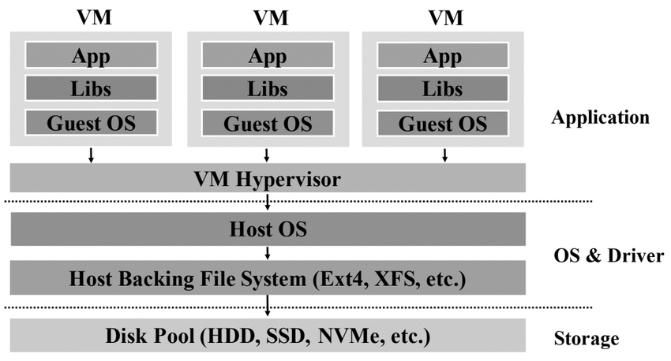
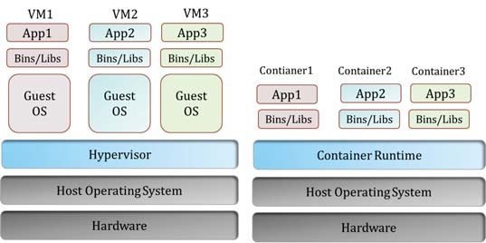
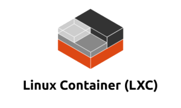
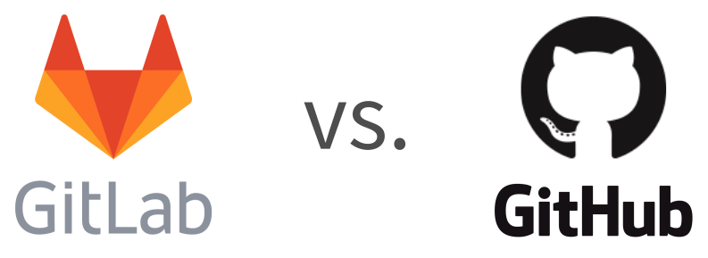

+++
title = "Reproducible Research Experiments"
outputs = ["Reveal"]
+++

# Reproducible Experiments 
# in Computer Science Research
## Martina Baiardi and Raphael Schwinger

---

# Table of Contents
## **Slide to be removed**

1. Introduction to reproducible research meaning (**Martina**)
2. Reproducibility starts from development: build tools (gradle x JVM, Poetry x Python) and frameworks (hydra) (**Raphael**)
3. Basics of Containerization: Dockerfile and docker-compose (**Martina**)
4. Hands on a project: RL reproducible experiment setup using Poetry and Hydra (**Raphael**)
5. Cherry on the top: automation. GitHub, OSS proj, CI/CD pipelines, Github Actions, ... (**Martina**)

---

# What is reproducibility?

{}{}

Reproducibility of experiments is the key to validating scientific claims.

1. **Validation of Results** that were claimed in the scientific publication
2. **Advancing Knowledge** without re-building everything from scratch

{}{}


{}{}

---

# How does this affect us as computer scientist?
## Let's make an example

* I find an interesting paper that fits my research needs.

* The authors' methods seem perfect for my work, so I want to dive deeper into their experiment.

* I look for the companion artifact... <b> What can go wrong? </b>

---

## 1) Artifacts not available


The link to the research artifacts (code, data, etc.) is broken.


---

## 2) Missing an explanation on how to execute it

* The artifacts are available but in non-standard formats that researchers can be unfamiliar with.
* The file sizes are unexpectedly large.
* No clear instructions on how to use them.

<br/>
<br/>

> Example: How would you open and execute a `duffy-duck.qcow2` file that weights 20GB? Yes, it can be a valid artifact.

---

## 3) The artifact is not running 

* Strange errors prevent the artifact to execute on my pc
* Runtime dependencies may be missing, but `which` ones?

--- 

## Finally, let's don't forget about
## the elephant in the room


--- 

# As computer scientists we can do better

We can demonstrate that our paper claims work,
by providing a reproducible companion artifact.

{}

However, reproducibility is a process that starts from software development:
1. **Reproducible builds**: Adoption of build automation tools to manage experiment dependencies.
2. **Isolation**: Prepare a lightweight containerized environment for the distribution of the experiment.
3. **Automation**: Create an automatic pipeline that tests the source-code and generates the artifacts, so you don't have to do it by hand.
4. **Open-Source Research**: protect your ownership by picking correct license.    

{}

---

# Build automation tools

Raphael you can continue here

---

# Containerization

---

## Long story short


<small>
Image <a href="https://external-preview.redd.it/kPQ__at4fKKgnYwxUE1Y50bSW7dMyypwpCgPUmFRg04.jpg?auto=webp&s=f3b7d41ce149fcc8074a02bd90f6d82f59c9544b">source</a>
</small>

---

## Actually, the story is longer

* Technically, a machine can be "shipped" using virtualization
* Virtual Machines encapsulates the whole Operating System. The result is:
  - a heavy-weight disk file (order of `GB`s)
  - a slower startup, and consequently running
* They rely on **hypervisors**, software that make hardware resources available to the virtualized host operating system.


 <br/>
<small>
Source: Research Gate. Available <a href="https://www.researchgate.net/figure/The-architecture-of-the-virtual-machine-hypervisor-based-on-9_fig1_333209316">here</a>.
</small>

---

## Do we really need the whole Operating System?

{}
In most cases the answer is <span class="red">no</span>
{}


<small>
Image <a href="https://georgiamurch.com/wp-content/uploads/2023/11/elephantintheroom.jpeg">source</a>
</small>

---

## What is containerization?

* Containerization is a lightweight form of virtualization
* It allows you to package and run applications and their dependencies in isolated environments, called containers.
* Ensures consistent environments for development, testing, and production.

---

## How Containers Work

{}{}

* Containers share the host system’s kernel but are isolated in their own user space.

* **Container Image**: A lightweight, standalone, executable package that includes everything needed to run the software.
* **Container**: A running instance of an image.

{}{}


<small>
Source: Research Gate. Available <a href=" https://www.researchgate.net/figure/rtual-Machine-Vs-Container_fig1_340812070 ">here</a>.
</small>

{}{}

---

## Container != Docker


**Docker** is an open-source platform for distributing and executing containers.

It's not the only solution, but we use it as a reference since it's the most used.





---

## Docker Key-Concepts

**Docker Image**: Template for creating containers, built from a `Dockerfile`.

**Docker Hub**: A cloud-based registry for storing and sharing Docker images.

**Dockerfile**: A text file containing a set of instructions to build a Docker image.

---

## Basic Docker Commands

`docker build`: Build an image from a `Dockerfile`.

`docker run`: Run a container from an image.

`docker ps`: List running containers on the machine.

`docker images`: List all locally available Docker images.

`docker stop`: Stop a running container.

---

## Creating a Dockerfile

A Dockerfile is a script with instructions on how Docker Image is built.

<div class="w-50 m-auto" style="font-size: 1.5em;">

```dockerfile
FROM python:3.9
WORKDIR /app
COPY . .
RUN pip install -r requirements.txt
CMD ["python", "experiment.py"]
```

</div>

Explanation:
* `FROM`: Specifies the base image (here, <a href="https://hub.docker.com/_/python">Python 3.9</a>).
* `WORKDIR`: Sets the working directory inside the container.
* `COPY`: Copies files from the host to the container.
* `RUN`: Executes `shell` commands inside the container.
* `CMD`: Defines the command to run when the container eventually starts.

Complete list of Dockerfile instructions <a href="https://docs.docker.com/reference/dockerfile/">here</a>.

---

## Building a Docker Image

To build the Docker image from the Dockerfile:

<div class="w-50 m-auto" style="font-size: 1.5em;">

```bash
docker build -t myapp:latest .
```

</div>

## Running a Docker Container

<div class="w-50 m-auto" style="font-size: 1.5em;">

```bash
docker run -d -p 5000:5000 myapp:latest
```

</div>

---

## Multi-Container Applications

> How many containers do you need for a web server?

{}

At least <span class="red">two</span>: One for the front-end and another for the backend. <span class="red">Plus another one</span> if there's also a database. 

**Do I need to configure and run each one independently?** 

{}

{}
Obviously no.

**Docker compose** is a tool for defining and running multi-container Docker applications using `YAML` syntax.

<div class="w-50 m-auto" style="font-size: 1.5em;">

```yaml
version: '3'
services:
  web:
    image: myapp
    ports:
      - "5000:5000"
  db:
    image: postgres
    environment:
      POSTGRES_PASSWORD: example
```

{}

</div>

Is simply run with:

<div class="w-50 m-auto" style="font-size: 1.5em;">

``` bash
docker-compose up
```

</div>

---

## Is this complexity worth it?

**Portability**:
Docker containers can run on any machine.

**Isolation**:
Each container is isolated, which means applications and dependencies do not conflict.

**Efficiency**:
Containers are lightweight and start quickly, allowing faster deployment cycles.

--- 

# Hands on a real example! 

Raphael you can continue here

---

# Automation

---


---

## Recipe for automation

Automation:
  1. Put your experiment in a **Repository**
  2. Choose a standard **license** 
  3. Configure **CI/CD**

---

## Code repositories

* Foster Collaboration
* Share changes on the codebase
* Provide auxiliary services
  - Issue tracking
  - CI/CD
  - Documentation hosting
* Most popular: `GitHub` and `GitLab`
* Prefer cloud-based solutions instead of on-premise ones
* Prepare a good `README.md` that describes how to execute the experiment
* **Just share the source files, do not share the builds! Prepare a correct `.gitignore`**



---

> Public or private repository?

{}
Open-sourcing allows the community to work on your problem, build on it and improve it!

> Are you afraid that someone can "steal" your work?

{}

{}

If you don't pick a **license**, your repository is considered `proprietary` even if it is public.

If you want to allow contributions, just pick the correct licensing: http://choosealicense.com/licenses/

{}

---

## CI/CD: Continuous Integration & Continuous Deployment

For each change on the source code:
  * automatically run a verification process
  * if tests succeed, then prepare the artifact
  * if the artifact is generated correctly, then publish it

---

Most code hosting platforms provide free limited plans for setting up CI/CD.

Usually, free plans are offered only for **public** repositories

**GitHub** <span class="fa fa-arrow-right"> </span> **GitHub Actions**

---

## GitHub Action Key concepts

  1. **Workflow**: automation process triggered by events (e.g., push, pull request, issue creation). 
  2. **Pipeline**: structured sequence of `jobs` (like build, test, deploy) executed as part of a workflow.

Each job runs in its own virtual machine or container.

Each job consists of multiple `steps`, which can include running shell commands or using prebuilt `actions`.

  3. **Actions**: reusable jobs that can be re-used 
  4. **Runners**: machines that execute workflows. 

GitHub provides hosted runners (Linux, macOS, Windows), or you can use self-hosted runners.

---

## Quickstart

Workflows are defined as `YAML` files inside `.github/workflows/` folder of the project.

If the folder exists, then GitHub tries to execute the workflows inside of that.

---

## Some examples

Trivial example: [this repository](https://github.com/anitvam/reproducible-research-lehrstuhlklausur-2025)

Better example: [submitted experiment](https://github.com/anitvam/uav-circle-2024-jakta-alchemist)

---

# You are free now

### Questions?